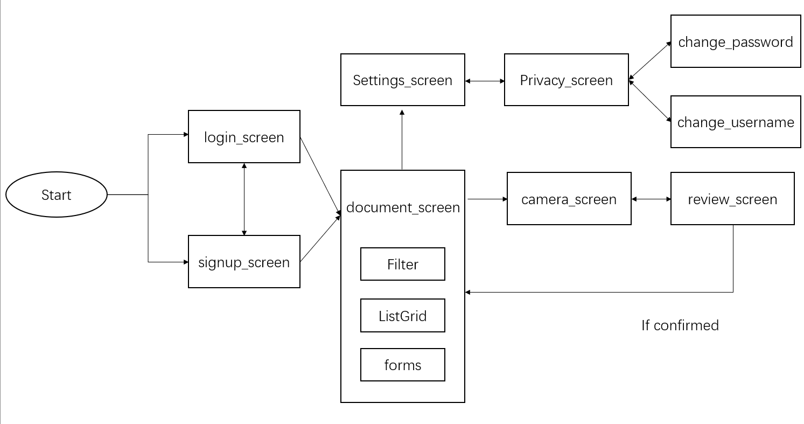

# scdao_mobile

This is the frontend part of FCDAO file scan and share app. 

## Table of contents

- [Quick start](#getting-started)
- [How to Use](#how-to-use)
- [What's included](#whats-included)
- [Module flowchart](#module-flowchart)
- [Creators](#creators)

## Getting Started


For help getting started with Flutter, view our
[online documentation](https://flutter.dev/docs), which offers tutorials, samples, guidance on mobile development, and a full API reference.

## How to Use 

**Step 1:**

Download or clone this repo by using the link below:

```
https://github.com/BU-Spark/se-scdao-mobile-flutter.git
```

**Step 2:**

Go to project root and execute the following command in console to get the required dependencies: 

```
flutter pub get 
```

**Step 3:**

Run the app on your device or emulator by using 

```
flutter run
```

About details. please view https://daily-dev-tips.com/posts/running-a-flutter-app-on-ios-and-android-emulators/

## What's included

* CRUD: create, update and remove users.
* Signup page and login page.
* Dashboard/Document page for users to view their scaned document and navigate to other pages, include filter and search function.
* Camera page for document scaning.
* review and confirmation page after scanning, if confirmed, navigate back to document page, if not, navigate back to camera page.
* Settings page for user settings, change password and username.
* Buttons, filter, forms and listGrid widegets.

## Module flowchart



## Creators

Zixuan Shu zmshu@bu.edu 
Zhe Tu tuzhe115@bu.edu 
Jerry Neequaye jerryn@bu.edu 
Eric Benfaida benfaida@bu.edu
Patricia Luis patluis@bu.edu 
